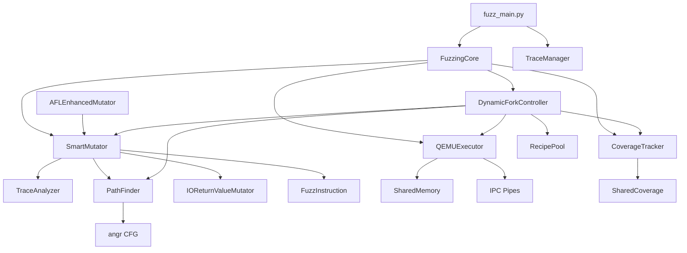
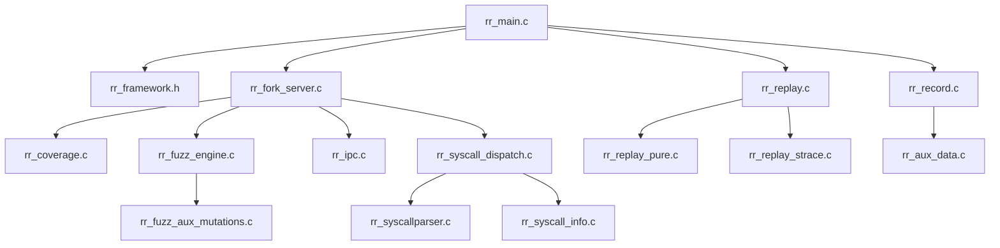

# RRFuzz 完整目录结构与变异模式分析

**版本**: 12.0  
**日期**: 2025-12-09

---

## 目录

1. [项目目录结构](#1-项目目录结构)
2. [变异模式完整分析](#2-变异模式完整分析)
3. [模块依赖关系](#3-模块依赖关系)

---

## 1. 项目目录结构

### 1.1 根目录结构

```
rr_fuzzing/
├── CLAUDE.md                    # Claude AI协作文档
├── DEEP_ANALYSIS_AND_FIXES.md   # 深度分析与修复记录
├── DETAILED_ARCHITECTURE.md     # 详细架构文档 (106KB)
├── Makefile                     # 构建脚本
├── meson.build                  # Meson构建配置
├── reproduce_crash.py           # Crash复现脚本
│
├── reproduce_crash.py           # Crash复现脚本
│
├── config/                      # ⚙️ 配置模板
│   ├── template/
│   │   ├── rr_config.fuzzing.template
│   │   ├── rr_config.record.template
│   │   └── rr_config.replay.template
│   └── usrdef/
││   ├── template/
│   │   ├── rr_config.fuzzing.template
│   │   ├── rr_config.record.template
│   │   └── rr_config.replay.template
│   └── usrdef/
│
├── core/                        # 🔧 C端核心框架 (7 files)
├── fuzzing/                     # 🎯 Python端Fuzzing (49 files)
├── record/                      # 📹 录制模块 (3 files)
├── replay/                      # ▶️ 重放模块 (6 files)
├── utils/                       # 🛠️ 工具函数 (18 files)
├── tests/                       # 🧪 测试程序
├── tools/                       # 🔨 辅助工具
├── paper/                       # 📝 论文资料
│
├── data/                        # 💾 数据目录 (不分析)
└── docs/                        # 📚 文档目录 (不分析)
```

### 1.2 core/ - C端核心框架

```
core/ [7 files, ~92KB]
│
├── rr_main.c           (35KB, 942行)   # 主入口，模式分发
├── rr_framework.h      (21KB)          # 框架头文件，核心数据结构
├── rr_config.c         (13KB)          # 配置解析
├── rr_constants.h      (8KB)           # 常量定义
├── rr_bb_trace.c       (7KB)           # 基本块追踪
├── rr_bb_trace.h       (4KB)           # BB追踪头文件
└── rr_debug.c          (4KB)           # 调试功能
```

**核心结构定义 (rr_framework.h)**:
- `rr_framework_t`: 全局框架状态
- `rr_trace_entry_t`: Trace条目
- `rr_syscall_t`: 系统调用信息

### 1.3 fuzzing/ - Python端Fuzzing引擎

```
fuzzing/ [4 subdirs, 14 files, ~250KB]
│
├── fuzz_main.py              (13KB)  # 入口点
├── fuzz_multiprocess.py      (7KB)   # 多进程入口
├── trace_analyzer.py         (23KB)  # Trace分析器
├── tree_visualizer.py        (25KB)  # 可视化
├── realtime_tree_visualizer.py (29KB) # 实时可视化
├── simple_tree_visualizer.py (16KB)  # 简化可视化
├── log_analyzer.py           (5KB)   # 日志分析
├── check_stats_consistency.py (7KB)  # 统计一致性检查
├── config.py                 (0.4KB) # 配置
│
├── conductor/               # 🎼 协调器层
├── multiprocess/            # 🔀 多进程模块
└── qemu_integration/        # 🔗 QEMU集成 (C)
```

#### 1.3.1 fuzzing/conductor/ - 协调器层

```
conductor/ [17 files, ~280KB]
│
├── __init__.py               (2KB)   # 模块导出
├── constants.py              (4KB)   # 常量定义
│
├── 📌 核心模块:
├── fuzzing_core.py           (70KB, 1492行)  # FuzzingCore主循环
├── qemu_executor.py          (37KB, 914行)   # QEMU执行器
├── trace_manager.py          (16KB, 421行)   # 种子管理
├── coverage.py               (15KB, 389行)   # 覆盖率追踪
│
├── 🎲 变异模块:
├── mutator.py                (59KB, 1314行)  # SmartMutator
├── io_mutator.py             (11KB, 344行)   # IOReturnValueMutator
├── afl_enhanced_mutator.py   (22KB, 580行)   # AFLEnhancedMutator
├── instruction.py            (4KB)            # FuzzInstruction
│
├── 📊 辅助模块:
├── bb_trace_parser.py        (7KB)   # BB trace解析
├── iteration_result.py       (7KB)   # 迭代结果
├── fuzzing_metrics.py        (9KB)   # 指标统计
├── init_detector.py          (12KB)  # 初始化检测
├── seed_manager_adapter.py   (12KB)  # 种子管理适配器
├── shared_memory.py          (9KB)   # 共享内存
└── mutation_dependency_graph.py (16KB) # 变异依赖图
```

#### 1.3.2 fuzzing/multiprocess/ - 多进程模块

```
multiprocess/ [14 files, ~225KB]
│
├── __init__.py                   (1KB)
│
├── 🛤️ 路径分析:
├── path_finder.py                (51KB, 1409行)  # CFG分析
├── dual_level_path_finder.py     (17KB)          # 双层PathFinder
│
├── 🔄 动态Fork:
├── dynamic_fork_controller.py    (39KB, 915行)   # Checkpoint探索
│
├── 📦 资源管理:
├── shared_resources.py           (14KB, 479行)   # SharedCoverage
├── corpus_manager.py             (15KB)          # Corpus管理
├── seed_queue_advanced.py        (13KB)          # 高级种子队列
├── recipe_pool.py                (12KB)          # Recipe池
│
├── 🔍 分析模块:
├── crash_analyzer.py             (18KB)          # Crash分析
├── energy_scheduler.py           (16KB)          # 能量调度
├── syscall_block.py              (3KB)           # Syscall块
│
└── 🎮 Master控制:
    └── fuzz_master.py            (21KB)          # 多进程主控
```

#### 1.3.3 src/engine/ - QEMU集成 (C端)

```
qemu_integration/ [4 files, ~60KB]
│
├── rr_coverage.c             (11KB, 359行)   # 边覆盖追踪
├── rr_coverage.h             (3KB)           # 覆盖头文件
├── rr_fuzz_engine.c          (31KB, 759行)   # 变异应用引擎
└── rr_fuzz_aux_mutations.c   (15KB)          # 辅助变异实现
```

### 1.4 utils/ - C端工具函数

```
utils/ [18 files, ~175KB]
│
├── 🔀 Fork Server:
├── rr_fork_server.c          (55KB, 1110行)  # Fork Server主逻辑
├── rr_nested_fork.c          (5KB)           # 嵌套Fork
├── rr_checkpoint.c           (1KB)           # Checkpoint
├── rr_snapshot.c             (1KB)           # 快照
│
├── 🔌 IPC通信:
├── rr_ipc.c                  (9KB)           # 进程间通信
│
├── 📝 Syscall处理:
├── rr_syscall_dispatch.c     (23KB)          # Syscall分发
├── rr_syscall_dispatch.h     (2KB)
├── rr_syscall_info.c         (9KB)           # Syscall信息
├── rr_syscall_info.h         (2KB)
├── rr_syscallparser.c        (26KB)          # Syscall解析
├── rr_syscallparser.h        (2KB)
├── rr_syscall_tree.c         (7KB)           # Syscall树构建
├── rr_syscall_tree.h         (3KB)
│
├── 🗺️ 地址映射:
├── rr_mapping_manager.c      (15KB)          # 地址映射管理
├── rr_mapping_manager.h      (2KB)
│
├── 📊 动态Trace:
├── rr_dynamic_trace.c        (13KB)          # 动态Trace
├── rr_dynamic_trace.h        (2KB)
│
└── 🔧 生成工具:
    └── syscall_generator.py  (20KB)          # Syscall生成器
```

### 1.5 record/ - 录制模块

```
record/ [3 files, ~70KB]
│
├── rr_record.c       (56KB)    # 录制主逻辑
├── rr_aux_data.c     (11KB)    # 辅助数据处理
└── rr_aux_data.h     (4KB)     # 辅助数据头文件
```

### 1.6 replay/ - 重放模块

```
replay/ [6 files, ~78KB]
│
├── rr_replay.c                     (29KB)  # 重放主逻辑
├── rr_replay_pure.c                (8KB)   # 纯重放
├── rr_replay_pure.h                (2KB)
├── rr_replay_pure_reapply.c        (7KB)   # 重放重应用
├── rr_replay_strace.h              (3KB)   # Strace头
└── rr_replay_strace_optimized.c    (30KB)  # 优化Strace
```

### 1.7 tests/ - 测试程序

```
tests/ [46+ files]
│
├── README.md
├── programs/              # 32个测试程序
├── additional_programs/
├── real_programs/
├── scripts/              # 11个测试脚本
└── bin/                  # 编译输出
```

---

## 2. 变异模式完整分析

### 2.1 变异器层次结构

```
                    ┌─────────────────────────────────────┐
                    │          变异器架构                  │
                    └───────────────────┬─────────────────┘
                                        │
         ┌──────────────────────────────┼──────────────────────────────┐
         │                              │                              │
         ▼                              ▼                              ▼
┌─────────────────┐          ┌─────────────────┐          ┌─────────────────┐
│   BaseMutator   │          │   SmartMutator  │          │AFLEnhancedMutat│
│   [L35-354]     │          │   [L357-1314]   │◀─ 继承 ──│   [580行]      │
│   随机变异       │          │   智能变异       │          │   AFL系统化    │
└────────┬────────┘          └────────┬────────┘          └────────┬────────┘
         │                            │                            │
         ▼                            │                            │
┌─────────────────┐                   │                            │
│IOReturnValueMut│◀── 组合使用 ───────┘                            │
│   [344行]       │                                                 │
│   IO返回值变异   │◀────────────────────────────────────────────────┘
└─────────────────┘
```

### 2.2 BaseMutator - 基础随机变异

**文件**: `mutator.py` L35-354  
**用途**: 简单随机变异，备用方案

```python
class BaseMutator:
    """基础变异引擎 - 简单随机变异"""
    
    def __init__(self, use_io_mutation=True):
        self.io_mutator = IOReturnValueMutator() if use_io_mutation else None
    
    def mutate(self, trace, fork_point=None):
        # 70% 概率使用IO返回值变异
        if self.use_io_mutation and random.random() < 0.7:
            return self._generate_io_mutations(trace, fork_point)
        
        # 30% 概率使用传统随机变异
        return self._generate_random_mutations(trace, fork_point)
```

**变异命令** (9种):
- FUZZ_CMD_FLIP_BITS
- FUZZ_CMD_INTERESTING_VALUES
- FUZZ_CMD_BOUNDARY_VALUE
- FUZZ_CMD_REPLACE_BUFFER
- FUZZ_CMD_MUTATE_FLAGS
- FUZZ_CMD_MUTATE_AUX_BUFFER
- FUZZ_CMD_TRUNCATE
- FUZZ_CMD_EXTEND
- FUZZ_CMD_LIGHT_MUTATION

### 2.3 SmartMutator - 智能变异

**文件**: `mutator.py` L357-1314  
**用途**: 基于trace分析的智能变异

#### 2.3.1 运行模式

| 模式 | 触发条件 | 描述 |
|------|----------|------|
| Recipe模式 | 有recipe文件或PathFinder | 使用精确变异配方 |
| 随机模式 | 无recipe | 使用11种策略随机变异 |
| 停滞模式 | 1000次无新coverage | 切换激进策略权重 |

#### 2.3.2 11种变异策略

| ID | 策略 | 常规权重 | 停滞权重 | 描述 |
|----|------|----------|----------|------|
| 0 | FLIP_BITS | 12% | 8% | 1-8位翻转 |
| 1 | INTERESTING_VALUES | 12% | 15% | 边界值注入 |
| 2 | TRUNCATE | 10% | 12% | 数据截断 |
| 3 | EXTEND | 14% | 20% | 数据扩展(溢出) |
| 4 | LIGHT_MUTATION | 8% | 5% | 轻量变异(1-2位) |
| 5 | MUTATE_AUX_BUFFER | 9% | 10% | 辅助缓冲区 |
| 6 | REPLACE_BUFFER小 | 9% | 8% | 4-32字节替换 |
| 7 | REPLACE_BUFFER大 | 10% | 12% | 64-1024字节替换 |
| 8 | BOUNDARY_VALUE | 10% | 12% | 边界值测试 |
| 9 | 漏洞模式 | 9% | 10% | 格式串/注入/遍历 |
| 10 | MUTATE_FLAGS | 7% | 8% | 标志位变异 |

#### 2.3.3 候选过滤

```python
def _filter_mutable_candidates(self):
    """优先级分层过滤"""
    # 1. Important syscalls (read, write, recv, send)
    # 2. Primary IO syscalls
    # 3. Secondary IO syscalls
    # 4. 其他安全syscalls
    # 排除: FORBIDDEN_MUTATION_SYSCALLS (mmap, sigaction等)
```

### 2.4 IOReturnValueMutator - IO返回值变异

**文件**: `io_mutator.py` [344行]  
**用途**: 专门变异IO syscall返回值

```python
class IOReturnValueMutator:
    """专门针对IO syscalls的返回值变异"""
    
    # 目标syscalls
    IO_SYSCALLS = ['read', 'write', 'recv', 'send', 'recvfrom', 'sendto', 
                   'pread64', 'pwrite64', 'readv', 'writev']
    
    # 变异策略
    STRATEGIES = ['boundary', 'powers_of_2', 'incremental', 'buffer_overflow']
```

**变异策略**:
- `boundary`: 边界值 (0, -1, max_value)
- `powers_of_2`: 2的幂 (1, 2, 4, 8, 16...)
- `incremental`: 增量变化 (+1, -1, +10, -10)
- `buffer_overflow`: 溢出触发 (size+1, size*2)

### 2.5 AFLEnhancedMutator - AFL系统化变异

**文件**: `afl_enhanced_mutator.py` [580行]  
**用途**: AFL风格的系统化探索

```python
class AFLEnhancedMutator(SmartMutator):
    """继承SmartMutator，添加AFL系统化阶段"""
```

**AFL阶段** (16个):

| 阶段 | 名称 | 描述 |
|------|------|------|
| 1 | bitflip_1_1 | 1位翻转，步进1 |
| 2 | bitflip_2_1 | 2位翻转，步进1 |
| 3 | bitflip_4_1 | 4位翻转，步进1 |
| 4 | bitflip_8_8 | 8位翻转(字节)，步进8 |
| 5 | bitflip_16_8 | 16位翻转，步进8 |
| 6 | bitflip_32_8 | 32位翻转，步进8 |
| 7 | arith_8 | 8位算术 (+/-1~35) |
| 8 | arith_16 | 16位算术 |
| 9 | arith_32 | 32位算术 |
| 10 | interest_8 | 8位有趣值 |
| 11 | interest_16 | 16位有趣值 |
| 12 | interest_32 | 32位有趣值 |
| 13 | extras_uo | 用户字典(无覆盖) |
| 14 | extras_ao | 自动字典(有覆盖) |
| 15 | havoc | 随机混沌变异 |
| 16 | splice | 输入拼接 |

**策略分配**:
- 前80%迭代: AFL系统化探索
- 后20%迭代: SmartMutator智能变异
- 停滞状态: 混合使用

---

## 3. 模块依赖关系

### 3.1 Python模块依赖图



### 3.2 C模块依赖图



---

## 总结

### 代码统计

| 语言 | 文件数 | 代码行数 | 描述 |
|------|--------|----------|------|
| Python | ~50 | ~8000 | Fuzzing逻辑 |
| C | ~35 | ~5000 | QEMU集成 |
| **总计** | ~85 | ~13000 | 完整系统 |

### 变异模式总结

| 变异器 | 行数 | 策略数 | 适用场景 |
|--------|------|--------|----------|
| BaseMutator | 320 | 9 | 备用/简单 |
| SmartMutator | 958 | 11 | 主要模式 |
| IOReturnValueMutator | 344 | 4 | IO专用 |
| AFLEnhancedMutator | 580 | 16阶段 | AFL系统化 |

---

## 4. 核心代码详细分析

### 4.1 FuzzingCore.run_single_iteration() 主流程

```python
# fuzzing_core.py L549-924
def run_single_iteration(self, iteration_id):
    # 步骤1: Trace选择
    trace = self.trace_manager.select_trace()
    
    # 步骤2: 智能Fork点选择 (Coverage驱动)
    fork_points = self._select_coverage_driven_fork_points(trace, batch_size=5)
    
    for fork_point in fork_points:
        # 步骤3: 变异生成
        mutations = self.mutator.mutate(trace)
        
        # 步骤4: Fork执行
        results = self.execution_engine.execute_fork(
            trace.file_path, fork_point, [mutations], 0, iteration_id
        )
        
        # 步骤5: 覆盖率分析
        for result in results:
            has_new_coverage = self.coverage_tracker.has_new_coverage(result.coverage_bitmap)
            
            # 更新停滞检测
            self.mutator.update_stagnation_status(iteration, has_new_coverage)
            
            # Crash处理
            if result.crashed:
                self.crash_detector.save_crash(result, trace, mutations)
```

### 4.2 C端 rr_fuzz_engine.c 变异命令实现

```c
// rr_fuzz_engine.c L231-472
switch (instr->cmd) {
    case FUZZ_CMD_MUTATE_ARG:        // 参数变异
        if (instr->arg_index == 0xFF) {   // 0xFF = 返回值变异
            g_retval_override = *(abi_long *)instr->data;
            g_has_retval_override = true;
            // 自动Buffer Fill (input IO syscall)
        } else {
            args[instr->arg_index] = *(abi_long *)instr->data;
        }
        break;
        
    case FUZZ_CMD_REPLACE_BUFFER:    // 缓冲区替换
        cpu_memory_rw_debug(env, addr, instr->data, instr->data_len, 1);
        break;
        
    case FUZZ_CMD_MUTATE_FLAGS:      // 标志位XOR
        args[instr->arg_index] ^= *(abi_long *)instr->data;
        break;
        
    case FUZZ_CMD_BOUNDARY_VALUE:    // 边界值测试
        args[instr->arg_index] = *(abi_long *)instr->data;
        break;
        
    case FUZZ_CMD_FLIP_BITS:         // AFL位翻转
        // 读guest内存 → 应用XOR mask → 写回
        break;
        
    case FUZZ_CMD_INTERESTING_VALUES: // 特殊值注入
        cpu_memory_rw_debug(env, addr + offset, value, value_len, 1);
        break;
        
    case FUZZ_CMD_OVERWRITE_AT_OFFSET: // 精确偏移覆写
        // Recipe驱动, PathFinder生成
        cpu_memory_rw_debug(env, addr + instr->offset, instr->data, instr->size, 1);
        break;
}
```

### 4.3 SharedCoverage 多进程同步

```python
# shared_resources.py L58-160
class SharedCoverage:
    """使用multiprocessing.Array实现进程安全的覆盖率共享"""
    
    _shared_array = None  # 类级别共享 (所有Worker共用)
    _lock = None
    
    def __init__(self, worker_id):
        # 确保只初始化一次
        if SharedCoverage._shared_array is None:
            SharedCoverage._shared_array = mp.Array('B', 65536)  # unsigned char
            SharedCoverage._lock = mp.Lock()
        
        self.local_bitmap = bytearray(65536)  # 本地副本(减少锁竞争)
    
    def sync_coverage(self):
        """从全局同步到本地"""
        with self.lock:
            for i in range(65536):
                if self.shared_array[i] > self.local_bitmap[i]:
                    self.local_bitmap[i] = self.shared_array[i]
    
    def update_coverage(self, exec_bitmap):
        """更新全局(发现新coverage后)"""
        with self.lock:
            for i in range(len(exec_bitmap)):
                if exec_bitmap[i] > self.shared_array[i]:
                    self.shared_array[i] = exec_bitmap[i]  # 原子更新
```

### 4.4 TraceAnalyzer Syscall解析

```python
# trace_analyzer.py L134-220
class TraceAnalyzer:
    VALID_TRACE_MAGICS = {
        0x52525452: "RTRR",  # 旧格式
        0x52525254: "TRRR",  # 当前格式
    }
    
    def analyze(self):
        with open(self.trace_file, 'rb') as f:
            self._read_header(f)        # 读取magic, version
            self._read_syscall_records(f)  # 解析所有syscall
            self._classify_and_stats()   # Pure vs Hybrid分类
            self._load_bb_trace()        # 加载BB trace (.bbl)
    
    def _classify_and_stats(self):
        # Pure: 有aux_data的syscall (可变异)
        # Hybrid: 无aux_data的syscall
        for sc in self.syscalls:
            if sc.has_aux_data:
                self.pure_syscalls.append(sc)
            else:
                self.hybrid_syscalls.append(sc)
```

### 4.5 rr_fork_server.c 主循环

```c
// rr_fork_server.c L266-1026
int rr_fork_server_loop(void) {
    while (g_rr_framework->fork_server_active) {
        // 接收Python命令
        int cmd = rr_ipc_receive_command();
        
        switch (cmd) {
            case 'F':  // 单次Fork
                // 1. 加载mutations
                rr_fuzz_load_from_shared_memory(shm);
                
                // 2. Fork子进程
                pid = fork();
                if (pid == 0) {
                    // 子进程: 重置trace → 执行 → exit
                    rr_reset_trace_position();
                    return 1;  // 继续执行target
                }
                
                // 3. 父进程: 等待 → 发送状态
                waitpid(pid, &status, ...);
                rr_ipc_send_status(STATUS_AT_FORK_POINT);
                break;
                
            case 'B':  // 批量Fork
            case 'C':  // Checkpoint Fork
            case 'Q':  // 退出
        }
    }
}
```
