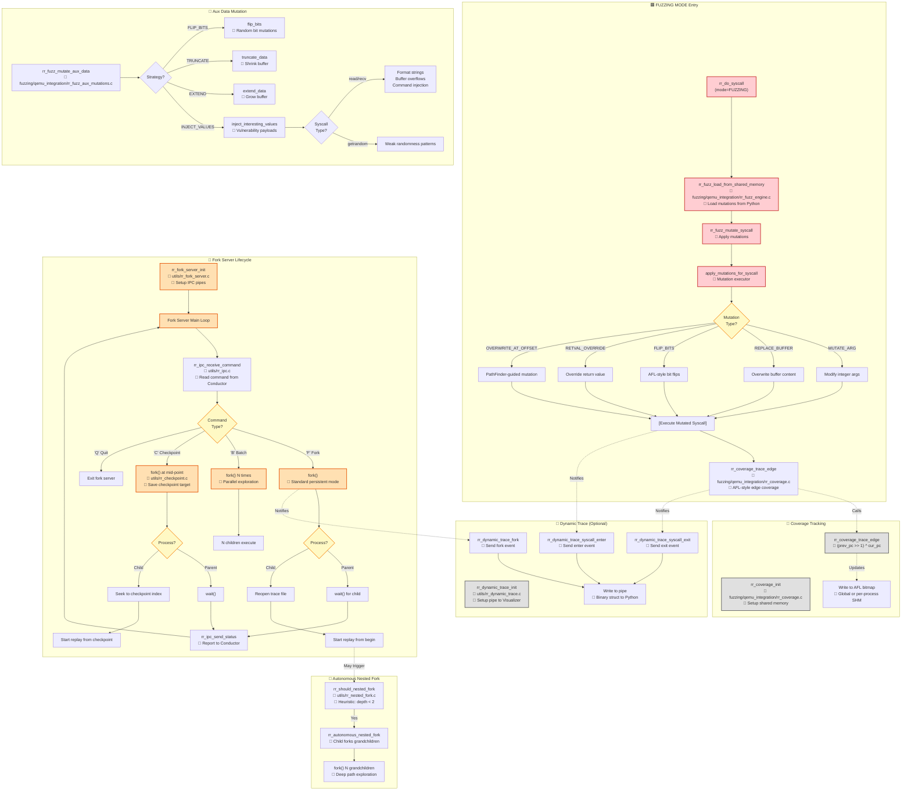

# RR-Fuzz Call Graph - Part 3: Fuzzing & Advanced Features

Fuzzing 模式的完整调用流程，包括 Fork Server、Mutation Engine、Coverage Tracking 和 Dynamic Tracing。



## 关键决策点

### 1. Fork Server Command Processing (utils/rr_fork_server.c:L200-350)
```c
char cmd = rr_ipc_receive_command();
switch (cmd) {
    case 'F': // Standard Fork - persistent mode
        fork_and_replay();
        break;
    case 'B': // Batch Fork - N parallel children
        batch_fork_and_replay(N);
        break;
    case 'C': // Checkpoint Fork - resume from mid-point
        checkpoint_fork(checkpoint_index);
        break;
    case 'Q': // Quit
        return;
}
```

### 2. Mutation Type Application (fuzzing/qemu_integration/rr_fuzz_engine.c:L228-465)
```c
switch (instr->cmd) {
    case FUZZ_CMD_MUTATE_ARG:         // Integer mutation
    case FUZZ_CMD_REPLACE_BUFFER:     // Buffer content replacement
    case FUZZ_CMD_FLIP_BITS:          // AFL bit flips
    case FUZZ_CMD_INTERESTING_VALUES: // Dictionary injection
    case FUZZ_CMD_OVERWRITE_AT_OFFSET: // PathFinder-guided
    case FUZZ_CMD_MUTATE_RETVAL:      // Return value override
}
```

### 3. Coverage Strategy (fuzzing/qemu_integration/rr_coverage.c:L158-250)
```c
// AFL-style edge coverage
uint32_t edge = (prev_pc >> 1) ^ cur_pc;
coverage_bitmap[edge % BITMAP_SIZE]++;
prev_pc = cur_pc;
```

**Shared Memory Strategies**:
- **Global SHM**: `RR_COVERAGE_SHM` - AFL++ compatible
- **Per-Process SHM**: `RR_COVERAGE_SHM_<PID>`
- **File-backed**: `file:/tmp/coverage.map`

### 4. Autonomous Nested Fork (utils/rr_nested_fork.c:L35-162)
**Trigger Conditions**:
1. `is_autonomous_child == true` (created by Fork Server)
2. `current_depth < 2` (prevent fork bomb)
3. `forks_this_iteration < MAX_FORKS_PER_PROCESS`
4. **Hardcoded**: Currently triggers on 5th syscall (demo/test)

**Mechanism**:
- Child process autonomously decides to fork grandchildren
- Each grandchild gets independent trace file handle
- Parent waits for all grandchildren before continuing

## Advanced Features

### Vulnerability Payload Injection
`inject_interesting_values` (rr_fuzz_aux_mutations.c:L249-372) contains hardcoded payloads:
- **Format String**: `%s%n`, `%p%x`
- **Buffer Overflow**: `'A' * N`
- **Command Injection**: `$(id)`
- **Path Traversal**: `../../etc/passwd`
- **Integer Overflow**: `0x7FFFFFFF`, `0xFFFFFFFF`

### Checkpoint Mid-Point Fork
Allows forking from arbitrary trace positions:
1. Conductor sends `'C'` command with `fork_point=50`
2. Child seeks trace file to position 50
3. Resumes replay from that point
4. **Benefit**: Skip expensive early initialization syscalls

## Integration with Python Conductor

```
Python Conductor
    ↓ (Write to Shared Memory)
[FuzzInstruction array]
    ↓ (Send Fork command via Pipe)
Fork Server (QEMU C-side)
    ↓ (fork())
Child Process
    ↓ (Replay + Mutate)
Coverage Bitmap
    ↑ (Read from Shared Memory)
Python Conductor
```

## Performance Optimizations

1. **Zero-Copy Mutations**: Shared memory avoids IPC overhead
2. **Persistent Fork Server**: Avoid QEMU startup cost
3. **Batch Forking**: Parallel exploration
4. **Pure Replay**: Skip real syscalls when possible
5. **Buffered I/O**: Reduce trace file I/O

## Next Steps
- [Main Index](./call_graph_index.md) - Overview of all graphs
