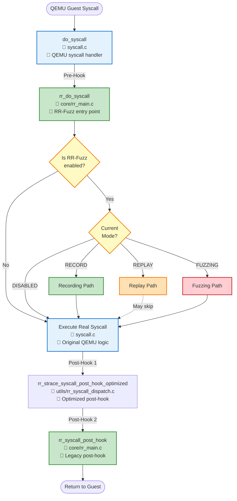

# RR-Fuzz Call Graph - Part 1: Main Entry Flow

从 `do_syscall` 到模式选择的完整调用流程。



## 关键决策点

### 1. RR-Fuzz Enabled Check (rr_do_syscall:L10-15)
```c
if (!g_rr_framework || !g_rr_framework->enabled) {
    // Skip to real syscall
}
```

### 2. Mode Selection (rr_do_syscall:L20-40)
```c
switch (g_rr_framework->mode) {
    case RR_MODE_RECORD:   // Record path
    case RR_MODE_REPLAY:   // Replay path  
    case RR_MODE_FUZZING:  // Fuzzing path
    case RR_MODE_DISABLED: // Fallthrough
}
```

### 3. Post-Hook Redundancy Issue
⚠️ **Known Issue**: `rr_syscall_post_hook` has overlapping functionality with `rr_strace_syscall_post_hook_optimized`. The optimized version in `rr_syscall_dispatch.c` is preferred.

## Next Steps
- [Graph 2: Record & Replay Detailed Flow](./call_graph_record_replay.md)
- [Graph 3: Fuzzing Detailed Flow](./call_graph_fuzzing.md)
