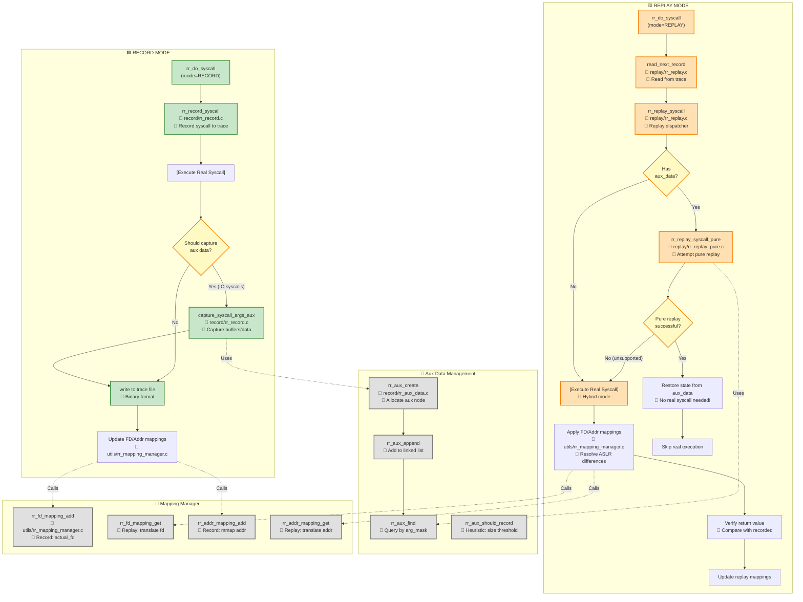

# RR-Fuzz Call Graph - Part 2: Record & Replay Flow

Record 和 Replay 模式的完整调用流程，包括 Pure Replay 和 Hybrid Replay 分支。



## 关键决策点

### 1. Aux Data Capture Decision (record/rr_record.c:L245)
```c
bool should_capture_aux = rr_aux_should_record(syscall_nr, args, ret);
// Heuristic: IO syscalls + success + size > threshold
if (should_capture_aux) {
    capture_syscall_args_aux(env, num, args, ret, record);
}
```

### 2. Pure vs Hybrid Replay (replay/rr_replay.c:L85)
```c
if (record->aux_data) {
    // Try Pure Replay first
    int pure_result = rr_replay_syscall_pure(env, record, args);
    if (pure_result == 0) {
        return; // Success, skip real syscall
    }
    // Fall through to Hybrid
}
// Hybrid: execute real syscall with mapping translation
```

### 3. Pure Replay Supported Syscalls (replay/rr_replay_pure.c:L50-120)
✅ **Supported**:
- `read`, `pread64` - restore buffer content
- `getrandom` - restore random bytes
- `recv`, `recvfrom` - restore network data
- `ioctl` - restore output buffers

❌ **Not Supported** (fallback to Hybrid):
- `brk`, `mmap` - need real execution for address allocation
- `write`, `send` - output syscalls
- Most others

### 4. Mapping Manager Strategy
**Problem**: ASLR causes different memory addresses between Record & Replay.

**Solution**:
1. **Record**: Store `(recorded_fd, actual_fd)` and `(recorded_addr, actual_addr)` pairs
2. **Replay**: Translate all FD/addresses using hash table lookup (O(1))

## Known Issues

⚠️ **Double Capture Bug** (record/rr_record.c):
- If `use_legacy_capture=true`, both `capture_syscall_args()` and `capture_syscall_args_aux()` may capture the same data
- **Fix**: Set `use_legacy_capture=false` (default in new config)

## Next Steps
- [Graph 3: Fuzzing & Fork Server Flow](./call_graph_fuzzing.md)
