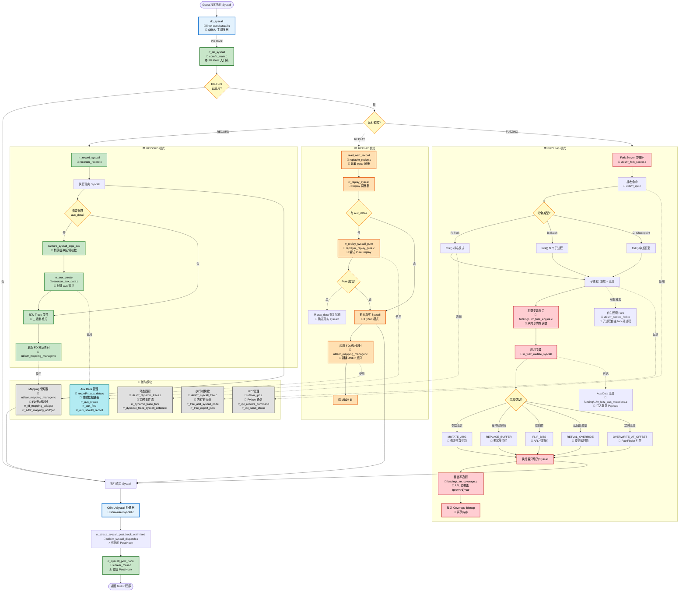

# RR-Fuzz 完整系统调用图

从 `do_syscall` 开始的完整调用关系全景图。



## 📊 调用图说明

### 🔵 蓝色：QEMU 集成层
- **do_syscall**: QEMU 的系统调用入口
- **真实 Syscall 处理器**: 执行实际的系统调用

### 🟢 绿色：RR-Fuzz 核心 + Record 模式
- **rr_do_syscall**: RR-Fuzz 的统一入口点
- **Record 路径**: 记录 syscall 到 trace 文件

### 🟨 黄色：Replay 模式
- **Pure Replay**: 从 aux_data 恢复，无需真实 syscall
- **Hybrid Replay**: 执行真实 syscall，使用映射翻译

### 🟥 红色：Fuzzing 模式
- **Fork Server**: 持久化 fuzzing 框架
- **Mutation Engine**: 7 种变异策略
- **Coverage Tracking**: AFL 风格边覆盖

### 🔷 灰色：辅助模块
- **Mapping Manager**: 解决 ASLR 问题
- **Aux Data**: Pure Replay 核心数据
- **IPC**: Python ↔ C 通信桥梁

### ⚠️ 黄色菱形：关键决策点
- 是否启用 RR-Fuzz？
- 当前运行模式？
- 是否有 aux_data？
- Pure Replay 是否成功？

## 🎯 三大执行路径

### 路径 1: Record (绿色)
```
do_syscall → rr_do_syscall → rr_record_syscall 
→ 执行真实 syscall → 捕获 aux_data → 写入 trace → 更新映射
```

### 路径 2: Replay (黄色)
```
do_syscall → rr_do_syscall → read_next_record → rr_replay_syscall
├─ Pure: 从 aux_data 恢复 → 跳过真实 syscall
└─ Hybrid: 执行真实 syscall → 应用映射翻译
```

### 路径 3: Fuzzing (红色)
```
Fork Server 循环 → 接收命令 → fork() 
→ 子进程: 加载变异 → 应用变异 → 执行 syscall → 记录覆盖率
```

## 🔗 关键模块依赖

```
Record ──使用──> Mapping Manager
             └──> Aux Data Manager

Replay ──使用──> Mapping Manager  
             └──> Aux Data Manager

Fuzzing ──使用──> IPC Manager
              ├──> Coverage Tracker
              ├──> Dynamic Trace
              └──> Fork Server
```

---

**说明**: 
- 实线箭头 (→) 表示直接函数调用
- 虚线箭头 (-.→) 表示模块依赖或可选调用
- 子图表示功能模块的边界
