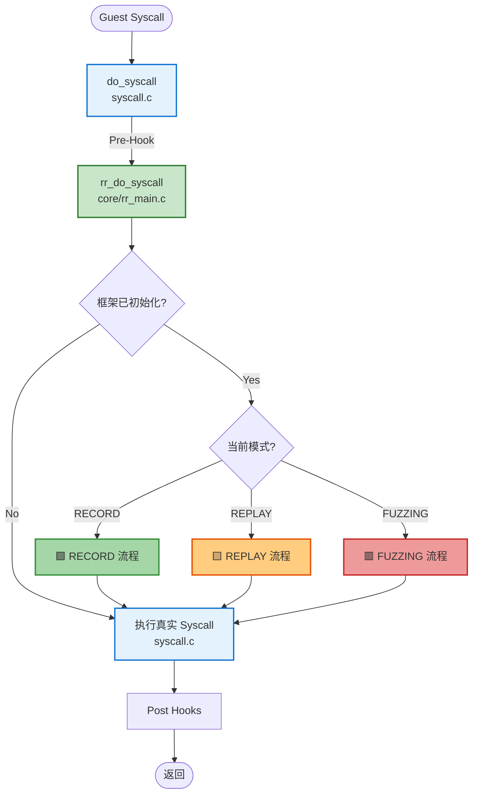
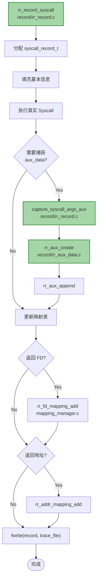
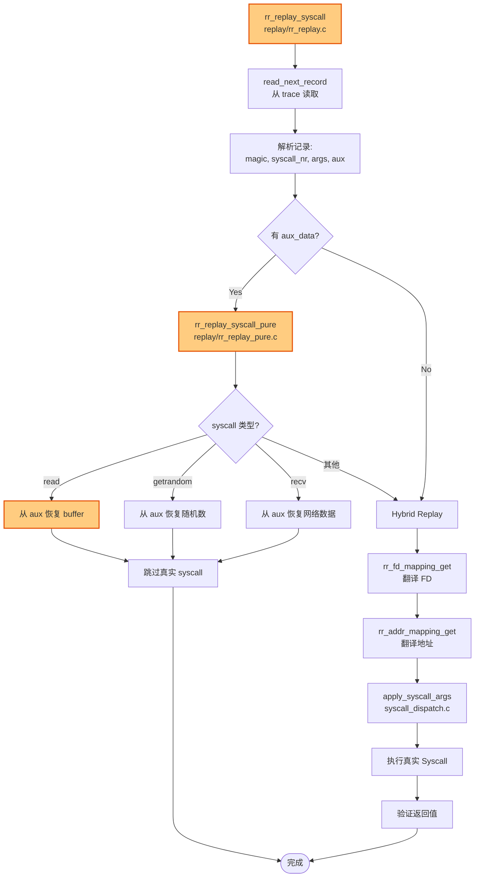
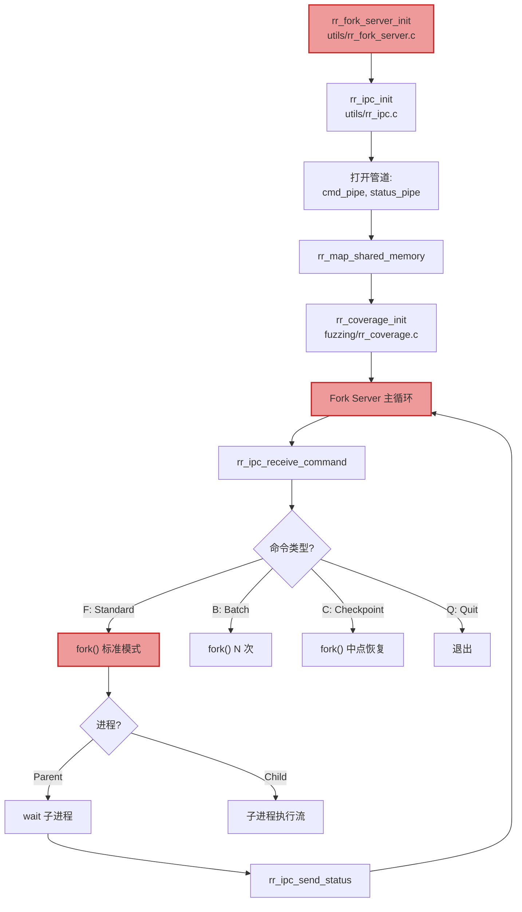
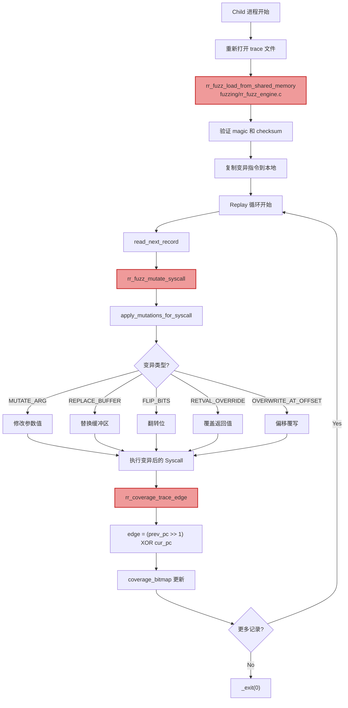
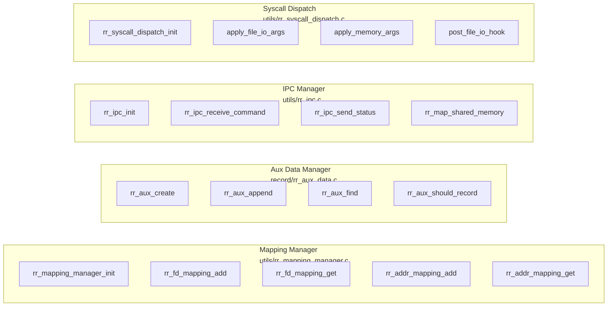
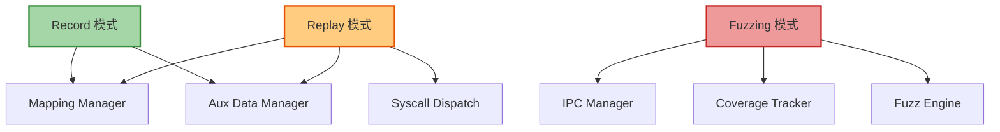

# RR-Fuzz 详细调用图（优化版）

优化的完整调用关系图，解决了Mermaid解析问题。

由于完整的超详细图表过于复杂，我创建了**分层视图**：

## 📊 第1层：核心入口与模式选择

## 📊 第2层：RECORD 模式详细流程

## 📊 第3层：REPLAY 模式详细流程

## 📊 第4层：FUZZING 模式 - Fork Server

## 📊 第5层：FUZZING 模式 - 子进程变异

## 📊 第6层：辅助模块接口

## 🔗 模块依赖关系

## 📈 函数调用统计

### Record 模式主要函数
1. `rr_record_syscall` - 主入口
2. `capture_syscall_args_aux` - 捕获辅助数据
3. `rr_aux_create` - 创建 aux 节点
4. `rr_fd_mapping_add` - FD 映射
5. `rr_addr_mapping_add` - 地址映射
6. `fwrite` - 写入 trace

### Replay 模式主要函数
1. `rr_replay_syscall` - 主入口
2. `read_next_record` - 读取记录
3. `rr_replay_syscall_pure` - Pure Replay 尝试
4. `rr_aux_find` - 查找 aux 数据
5. `rr_fd_mapping_get` - FD 翻译
6. `rr_addr_mapping_get` - 地址翻译
7. `apply_syscall_args` - 参数应用

### Fuzzing 模式主要函数
1. `rr_fork_server_loop` - 主循环
2. `rr_ipc_receive_command` - 接收命令
3. `fork` - 创建子进程
4. `rr_fuzz_load_from_shared_memory` - 加载指令
5. `apply_mutations_for_syscall` - 应用变异
6. `rr_coverage_trace_edge` - 覆盖率追踪
7. `rr_ipc_send_status` - 状态报告

## 🎯 关键决策点总结

| 决策点 | 位置 | 判断条件 |
|--------|------|----------|
| **RR-Fuzz 启用** | rr_do_syscall | g_rr_framework != NULL && enabled |
| **模式选择** | rr_do_syscall | mode (RECORD/REPLAY/FUZZING) |
| **Aux Data 捕获** | rr_record_syscall | rr_aux_should_record() |
| **Pure Replay** | rr_replay_syscall | aux_data != NULL && syscall 支持 |
| **Fork Server 命令** | Fork Server Loop | 'F'/'B'/'C'/'Q' |
| **变异类型** | apply_mutations | instr->cmd |

---

这个分层视图更易于理解，同时避免了 Mermaid 的解析问题。每一层都聚焦于特定的功能模块，可以独立查看。
