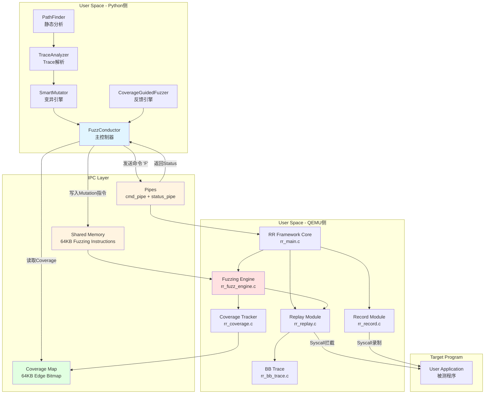
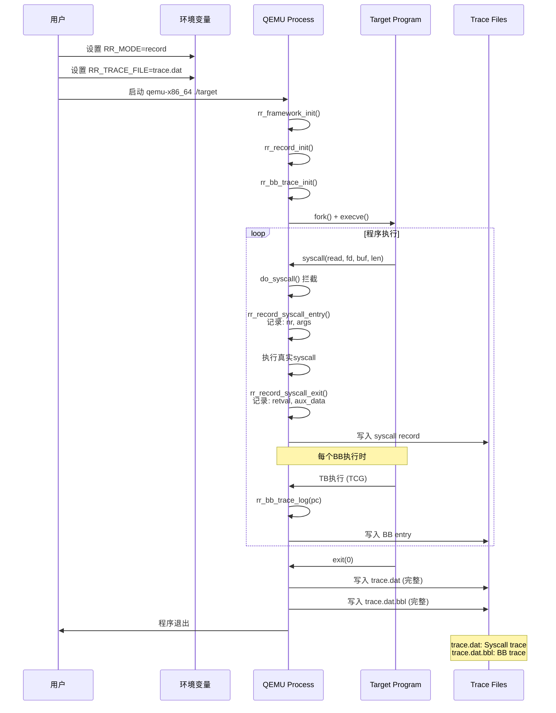
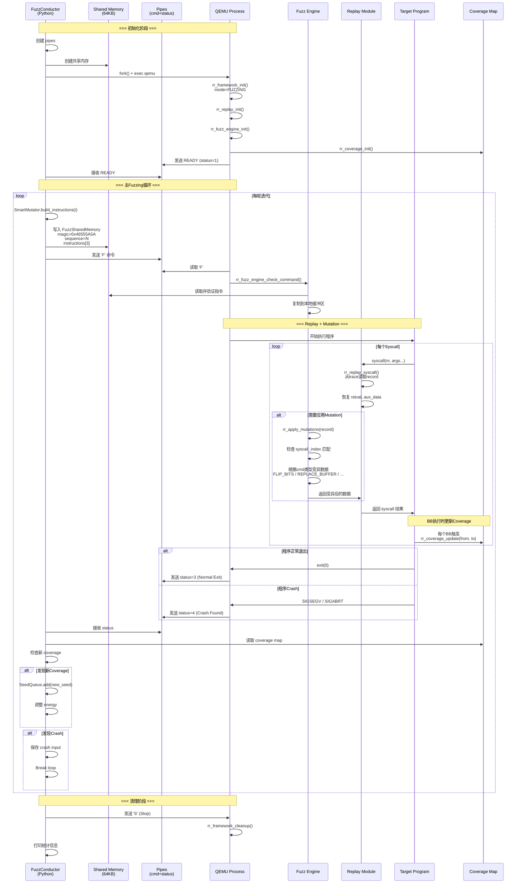
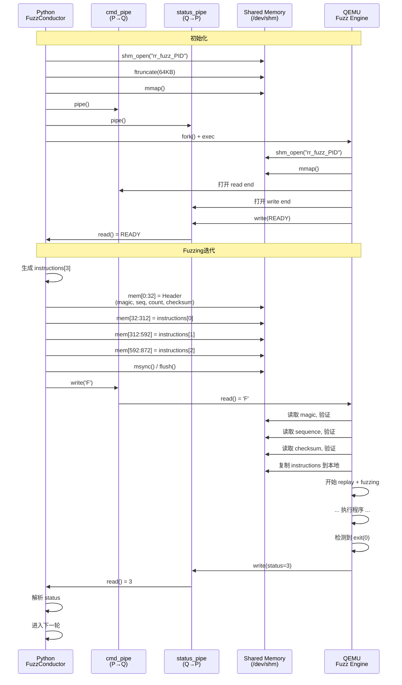
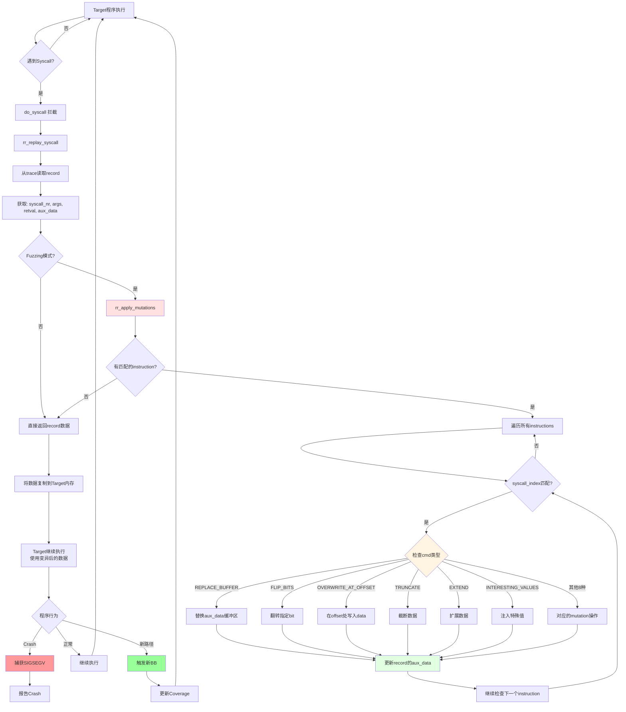
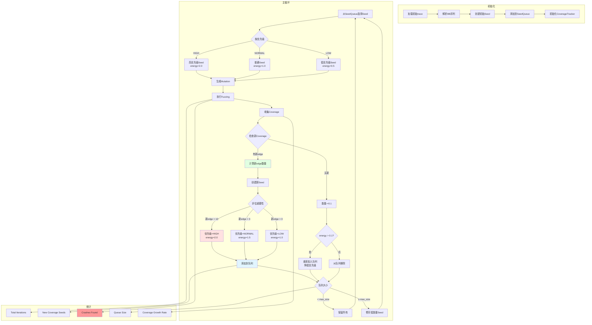
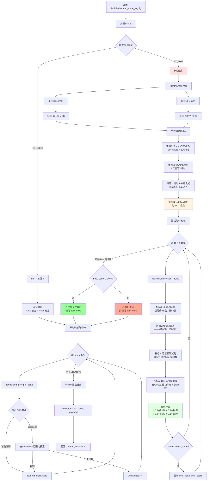
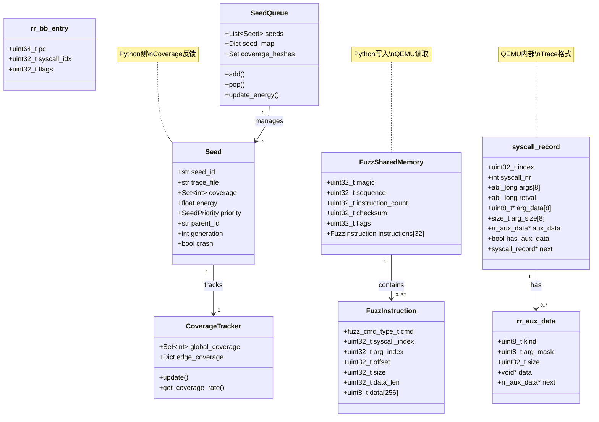
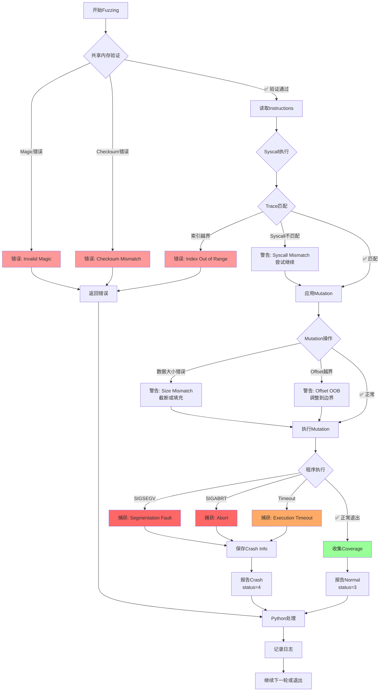

# RR-Fuzz 交互流程图

**版本**: RR-Fuzz 2.1  
**日期**: 2025-10-31

---

## 目录

1. [整体架构图](#整体架构图)
2. [Record模式流程](#record模式流程)
3. [Fuzzing模式详细流程](#fuzzing模式详细流程)
4. [IPC通信序列图](#ipc通信序列图)
5. [Mutation应用流程](#mutation应用流程)
6. [Coverage反馈循环](#coverage反馈循环)

---

## 1. 整体架构图

---

## 2. Record模式流程

---

## 3. Fuzzing模式详细流程

---

## 4. IPC通信序列图

---

## 5. Mutation应用流程

---

## 6. Coverage反馈循环

---

## 7. PathFinder PIE地址映射流程

---

## 8. 数据结构关系图

---

## 9. 时序对比：Record vs Replay vs Fuzzing

```mermaid
gantt
    title Syscall执行时序对比
    dateFormat X
    axisFormat %L ms
    
    section Record模式
    syscall entry hook    :0, 1
    真实syscall执行       :1, 15
    读取返回数据          :15, 17
    记录到trace           :17, 20
    syscall exit hook     :20, 21
    
    section Replay模式
    syscall entry hook    :0, 1
    从trace读取record     :1, 3
    恢复retval+aux_data   :3, 5
    跳过真实执行          :5, 5
    syscall exit hook     :5, 6
    
    section Fuzzing模式
    syscall entry hook    :0, 1
    从trace读取record     :1, 3
    检查mutation指令      :3, 5
    应用mutation          :5, 8
    恢复+变异的数据       :8, 10
    跳过真实执行          :10, 10
    更新coverage          :10, 12
    syscall exit hook     :12, 13
```

**对比分析**:
- Record: ~21ms（真实执行开销大）
- Replay: ~6ms（跳过真实执行，提速3.5x）
- Fuzzing: ~13ms（额外mutation开销，仍比Record快1.6x）

---

## 10. 错误处理流程

---

## 总结

这些交互图展示了RR-Fuzz的核心工作流程：

1. **架构清晰**: Python分析 + QEMU执行，职责分明
2. **IPC高效**: 共享内存传递数据 + Pipe传递控制信号
3. **Mutation精准**: 在syscall重放时刻应用变异
4. **Coverage驱动**: 实时反馈指导seed选择
5. **错误健壮**: 多层验证和错误处理

**性能特点**:
- Record: 慢（真实执行）
- Replay: 快（3.5x）
- Fuzzing: 中等（1.6x，包含mutation开销）

**可靠性**:
- 多重校验（Magic + Checksum）
- 优雅降级（部分失败仍可继续）
- 详细日志（便于调试）

---

**文档生成**: 2025-10-31  
**工具**: Mermaid + ASCII Art  
**用途**: 技术分析、团队培训、系统理解

